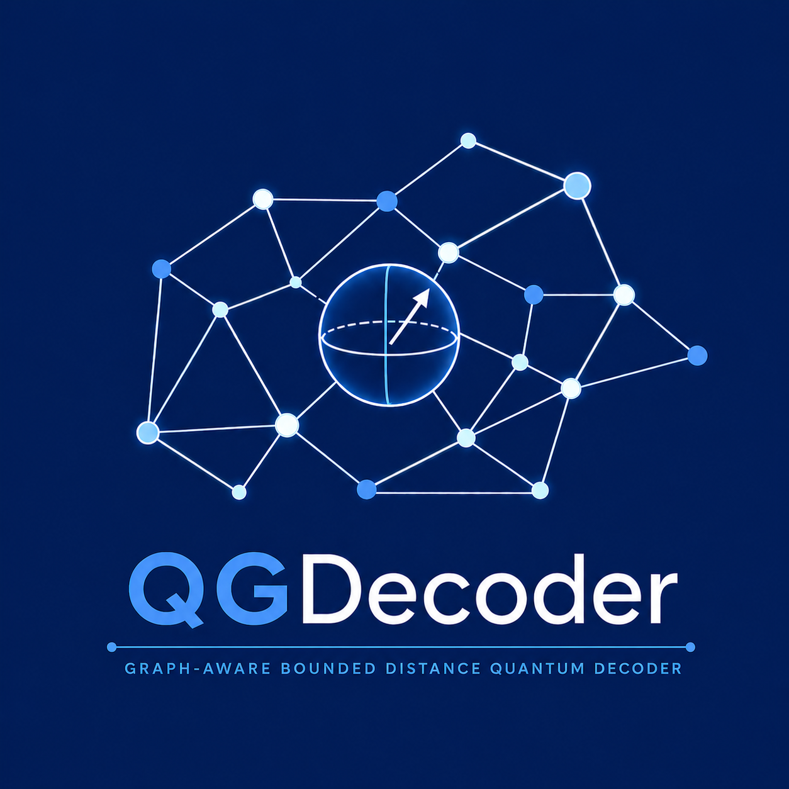

<p align="center">
  
</p>

**QGDecoder** is a graph-aware bounded distance quantum decoder supporting arbitrary stabilizer codes under depolarization channel.
- An $[[N,k,d]]$ quantum code corrects upto weight $t=(d-1)/2$ errors with certainty.   
- QGDecoder takes in a tunable target weight $T$. If $T\leq t$ it ensures all errors with weight $w\leq T$ are corrected.
- Graph state based bounded distance decoding.
- Additive.h supports both CSS and non-CSS codes.
- Use CSS.h for improved efficiency with CSS codes.

## Package features and requirements
- Header only package. Make sure the parent folder QGDecoder is accessible in you project file. Enjoy decoding!
- Written in C++ (use C++17 preferably).
- Linear algebra powered by Armadillo. Install from [here](http://arma.sourceforge.net/) to use QGDecoder.

## Usage
- Provide set of $N-k$ stabilizers (stabs) and $k$ logical operators (Lz and Lx) as C++ vector of strings of length $N$.
- Use only "X", "Y", "Z" or "I" to give the Pauli component e.g. "XZZXI" for five qubits.
- The struct stab_to_graph object S(stabs,Lz,Lx,d) returns the equivalent graph of the code
- By default Lz logicals are appended with stabs. Pass a boolean false as fifth argument to use Lx.  
- get_pauli_error_vector(N,w,p,error_type,seed_random) returns a random Pauli error string on $N$ qubits having atmost weight $w$ with single qubit error channel probability $p$. error_type='D'/'X'/'Y'/'Z' enables depolarisation/bit-flip/bit-phase flip/phase flip errors. Set random seeding with seed_random if not given system generated seed is used.

### Additive
- get_stabilizer_syndrome(E,S,stab_syn) returns the stabilizer syndrome stab_syn corresponding to Pauli error E.
- get_graph_syndrome(stab_syn,S,graph_syn) maps to the graph syndrome graph_syn.
- decode(graph_syn,T,S) decodes the graph syndrome with BDD target weight T and returns the correction C.

### CSS
- Use functions from CSS.h for CSS codes to get better efficiency by utilizing bipartite graph structure. 
- get_stabilizer_syndrome_CSS(E,S,stab_syn) returns the stabilizer syndrome stab_syn corresponding to Pauli error E.
- get_graph_syndrome_CSS(stab_syn,S,graph_syn_Z,graph_syn_X) maps to the Z and X graph syndromes graph_syn_Z,graph_syn_X.
- decode_CSS(graph_syn_Z,graph_syn_X,T,S) decodes the graph syndromes with BDD target weight T and returns the correction C.


- logical_error(E,C,Lz,Lx) returns true if there is an occurrence of logical error after the correction C.
- Just run the script files non-CSS.sh and CSS.sh to a simple demo.

## Standard quantum codes available with QGDecoder
- non-CSS [optimal codes](https://www.codetables.de/) of distance $d=3,5,7,9,11$.
- non-CSS [XZZX code](https://www.nature.com/articles/s41467-021-22274-1) on $d\times d$ square lattice.
- CSS triangular color code on triangular lattice of length $d$.
- CSS rotated surface codes on $d\times d$ square lattice.  

## Attribution

When using QGDecoder, please cite our [paper](https://arxiv.org/abs/2604.25424):

```bibtex
@misc{QGDecoder,
title={A graph-aware bounded distance decoder for all stabilizer codes}, 
author={Harikrishnan K J and Amit Kumar Pal},
year={2026},
eprint={2604.25424},
archivePrefix={arXiv},
primaryClass={quant-ph},
url={https://arxiv.org/abs/2604.25424}, 
}
